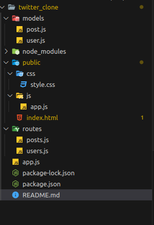
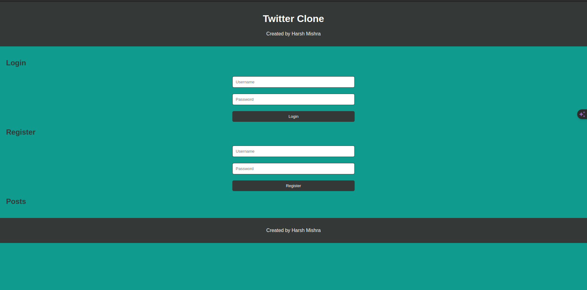
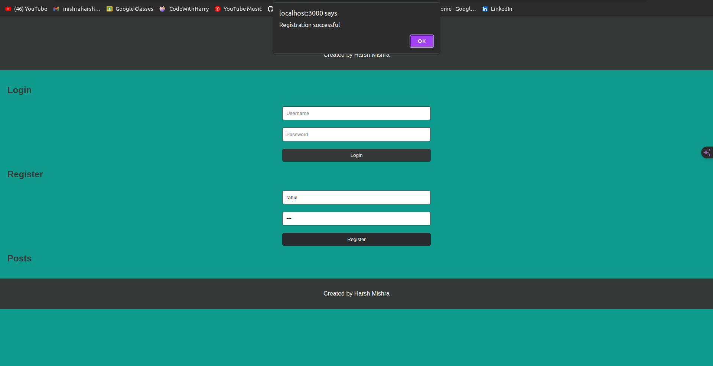
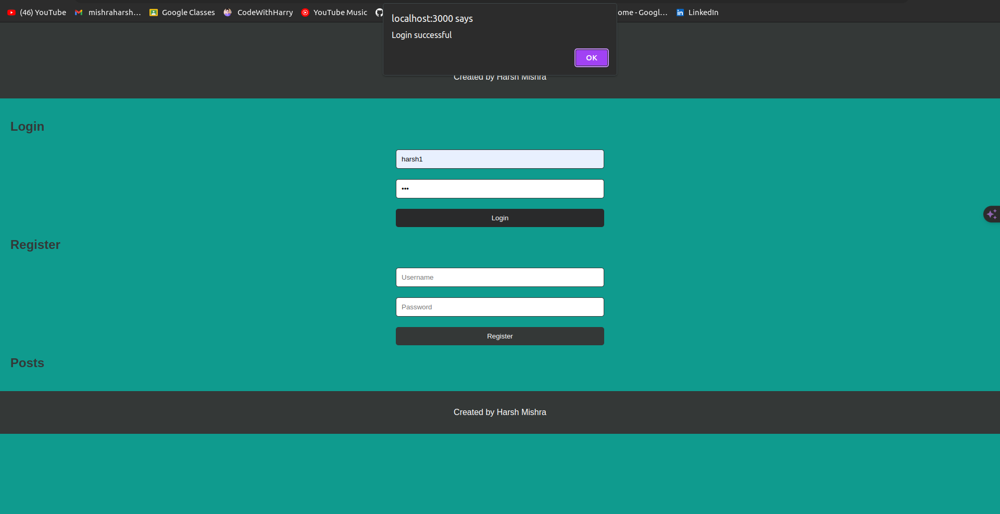
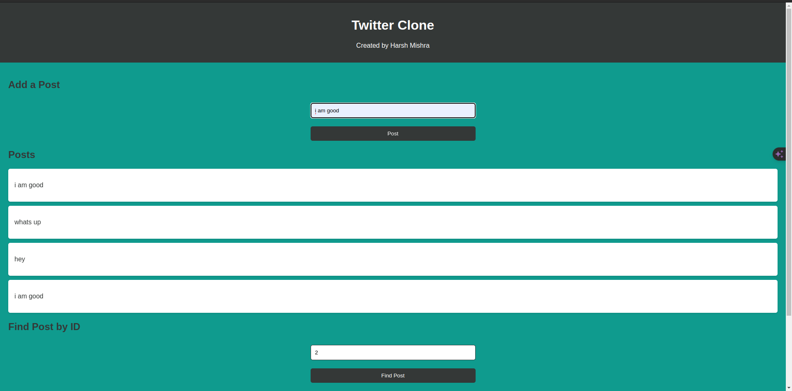
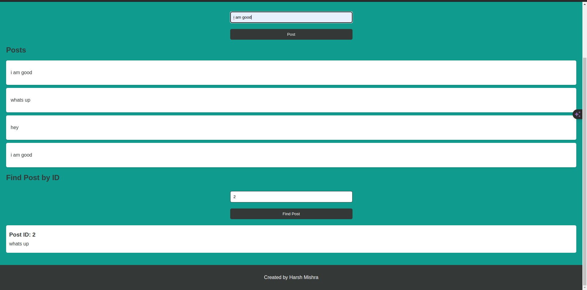
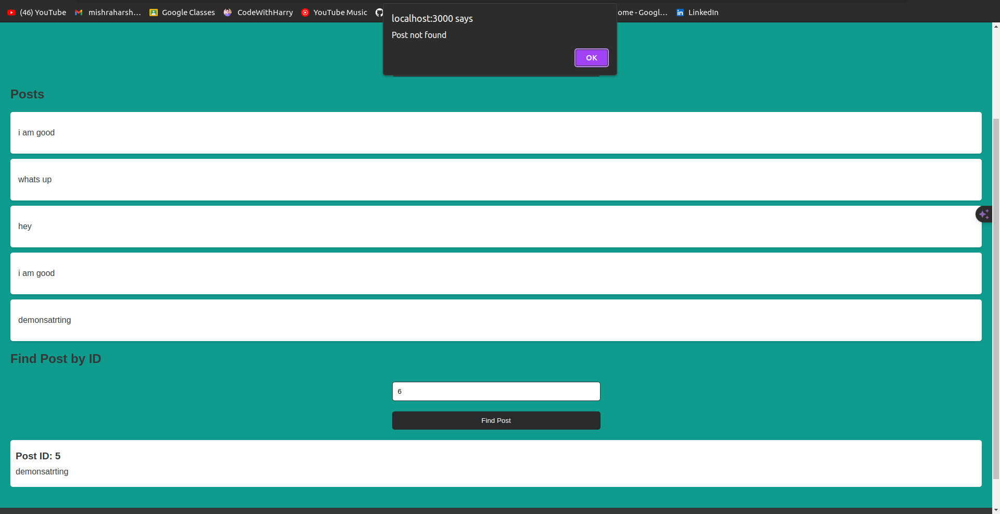

# Web Application for User Management and Posting

This project is a web application designed to demonstrate basic user management (registration and login) and content posting functionalities. Users can register, log in, post content, view all posts, and retrieve specific posts by ID.

## Table of Contents

- [Web Application for User Management and Posting](#web-application-for-user-management-and-posting)
  - [Table of Contents](#table-of-contents)
  - [Getting Started](#getting-started)
    - [Prerequisites](#prerequisites)
    - [Installation](#installation)
    - [Usage](#usage)
    - [Folder Structure](#folder-structure)
    - [API Endpoints](#api-endpoints)
      - [User Endpoints](#user-endpoints)
      - [Post Endpoints](#post-endpoints)
      - [Built With](#built-with)
  - [AUTHOR](#author)
    - [outputs :](#outputs-)

## Getting Started

These instructions will guide you through getting a copy of the project up and running on your local machine for development and testing purposes.

### Prerequisites

Before you begin, ensure you have the following software installed:

- Node.js
- npm (Node Package Manager)

### Installation

Follow these steps to set up your development environment:

1. Clone the repository:

```
git clone https://yourprojectrepository.git

```

- Navigate to the project directory:
```
cd yourprojectdirectory
```

- Install dependencies:
  ```
  npm install

  ```

  - Start the server:
  ```
  npm start

  ```
  ### Usage
- With the server running, visit http://localhost:3000 in your web browser to access the application.

### Folder Structure
- The project is organized as follows:
  
  

### API Endpoints
#### User Endpoints
- POST /users/register: Register a new user.
- POST /users/login: Authenticate an existing user.
#### Post Endpoints
- GET /posts: Fetch all posts.
- POST /posts: Submit a new post.
- GET /posts/:id: Retrieve a post by its ID.
#### Built With
- Node.js - The server environment.
- Express - The web application framework.
- JavaScript - For client-side scripting.


## AUTHOR
**HARSH MISHRA**


### outputs : 
- main page : 


- after registration


- after login
- 

- add a post and find the post


- find post by id
 

 - wrong id entered
  

- **END**